# Tasko-app
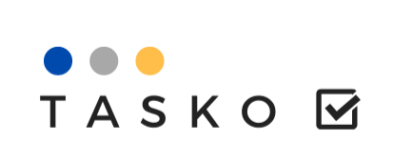

Proyecto libre desarrollado junto a un amigo para el curso de seminario de sistemas 1 donde trabaje el frontend de la aplicacion utilizando Vue js.

## Herramientas utilizadas

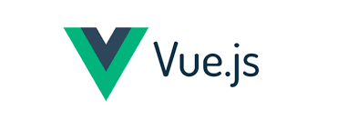

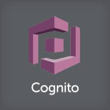

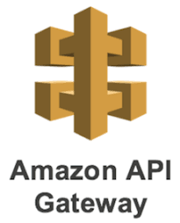
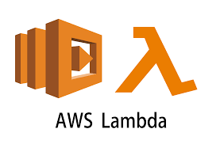

## Imagenes de la interfaz

La aplicacion permite registrarse por medio de amazon cognito, al ingresar los datos se envia un correo con un codigo de confirmacion que debe ser validado para completar el registro, luego puedes iniciar sesion.

En un tu dashboard puedes crear varios proyectos y dentro de cada uno crear varias notas, subir archivos etc.

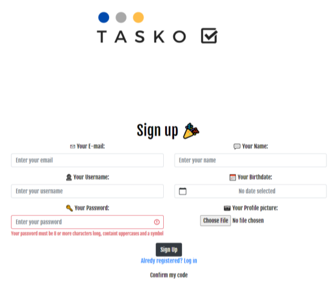
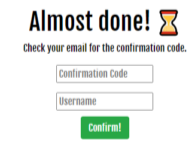
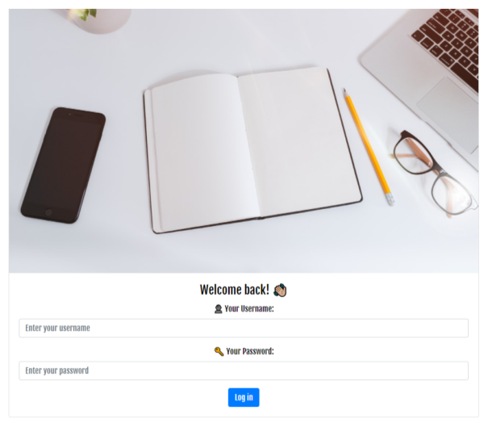
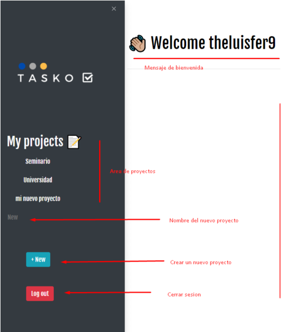
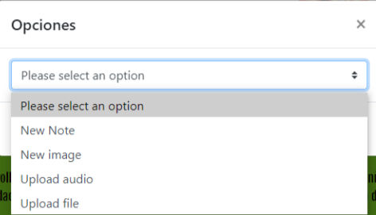
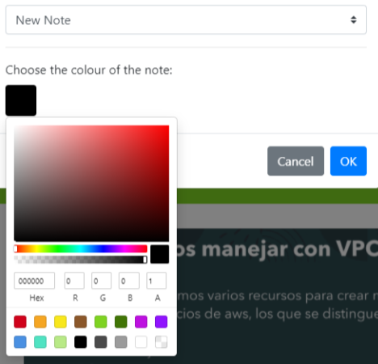
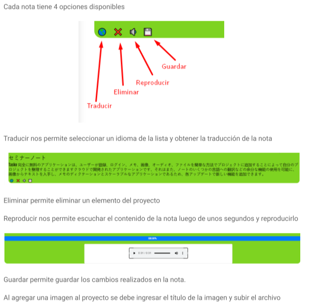